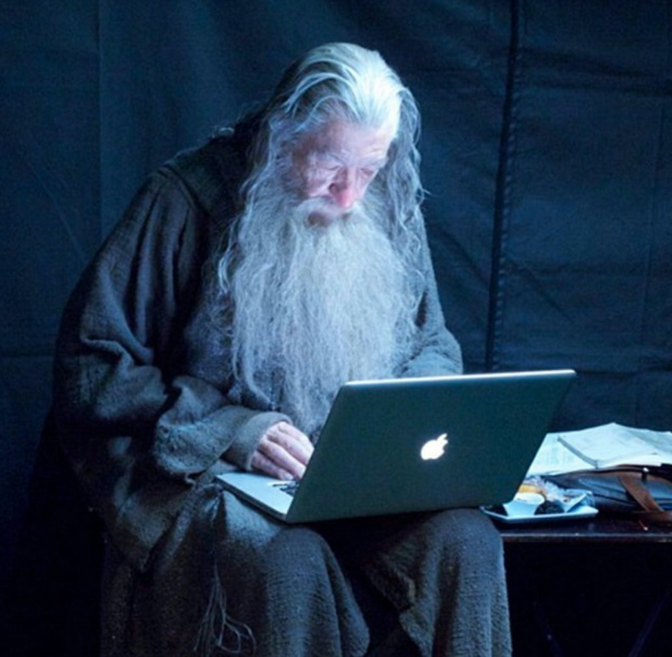
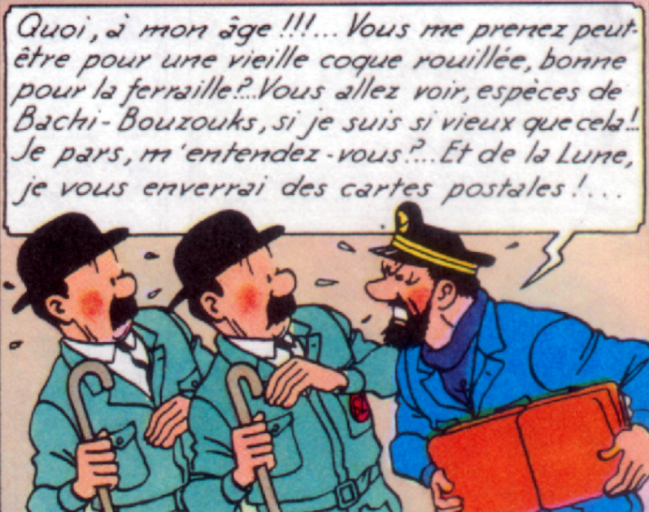

import { Head, Image, Root, Flex, Appear } from 'mdx-deck'
import { Invert, Split, FullScreen, SplitRight } from 'mdx-deck/layouts'
import { CodeSurfer } from "mdx-deck-code-surfer"
import Box from 'superbox'
import DemoStarwars from './DemoStarwars'
import SplitElement from './SplitElement'
import AppearDisappear from './AppearDisappear'
import base  from 'mdx-deck/themes'
import Highlight, { defaultProps } from "prism-react-renderer"
import nightOwl from "prism-react-renderer/themes/nightOwl"
import Code from './Code'


export const theme = {
  ...base,  
  //font: 'Roboto, sans-serif',
  font: 'system-ui, sans-serif',
  codeSurfer: {
    ...nightOwl,
    showNumbers: false
  }
}

<CodeSurfer
  title="Instructions"
  code={require("!raw-loader!./snippets/programming.R")}
  lang="python"
  steps={[
    { notes: "Tout ce qu'il faut développer de vrais programmes, bien sûr !" },
    { lines: [1, 13], notes: "Définition de fonction (passage par valeur des paramètres)" },
    { lines: [5, 10], notes: "Boucles for" },
    { range: [7, 9], notes: "Conditions" },
    { lines: [15], notes: "Appel de fonction" }
  ]}
/>

---

export default SplitRight


## GraalVM: an example

* Java micro-service using [SparkJava](http://sparkjava.com/)
* Génération d'une diagramme en R avec Ggplot2

---


<CodeSurfer
  title="La base"
  code={require("!raw-loader!./snippets/base.R")}
  lang="python"
  showNumbers={false}
  steps={[
    { notes: "Quelques notions de base..." },
    { range: [1, 4], notes: "Types de base et affectation" },
    { range: [6, 9], notes: "Les vecteurs (tous les éléments sont de même type)" },
    { range: [11, 22], notes: "Accès aux éléments d'un vecteur" },
    { range: [24, 32], notes: "Quelques opérations" },
    { range: [34, 48], notes: "Nommage des éléments" },
    { range: [50, 53], notes: "Fonctions de base sur les éléments" }
  ]}
/>

---
export default Split

<Box>
  <h2>whoami</h2>
  <p>Bruno Bonnin - @_bruno_b_</p>
  <i>Vieux développeur</i>
</Box>

<SplitElement backgroundColor="black" color="white">
  <AppearDisappear>
    
    
  </AppearDisappear>
</SplitElement>

```notes
Bien, tout d'abord, je me présente rapidement, je m'appelle Bruno Bonnin, je suis un vieux développeurs
ayant travaillé sur de nombreuses projets et j'ai pu mettre mon nez à tous les étages.
```

---

<Image src="img/builtin_fcts.png" size="contain"/>


```notes
https://cran.r-project.org/doc/contrib/Short-refcard.pdf
https://www.rstudio.com/resources/cheatsheets/

Il existe de nombreuses fonctions mathématiques et statistiques fournies de base par R,
ainsi des fonctions d'accès aux fichiers, permettant même de lire certains formats (csv)
```

---

> “The best thing about R is that it was written by statisticians. The worst thing about R is that it was written by statisticians”

– Bow Cowgill

---

<CodeSurfer
  title="rJava"
  code={require("!raw-loader!./snippets/rjava.R")}
  lang="python"
  steps={[
    { notes: "Librairie d'interface avec Java (via JNI)" },
    { range: [1, 3], notes: "Chargement et initialisation de la JVM" },
    { lines: [5], notes: "Instanciation d'un objet Java" },
    { range: [7, 8], notes: "Appel de méthode" },
    { range: [10, 14], notes: "Print d'un objet" }
  ]}
/>
