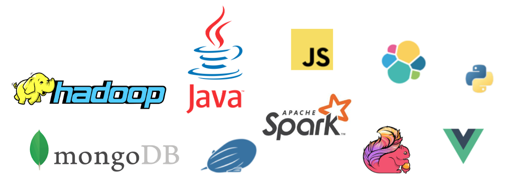

import { Head, Image, Root, Flex, Appear } from 'mdx-deck'
import { Invert, Split, FullScreen } from 'mdx-deck/layouts'
import { CodeSurfer } from "mdx-deck-code-surfer"
import Box from 'superbox'
import DemoStarwars from './DemoStarwars'
import SplitElement from './SplitElement'
import { dark } from 'mdx-deck/themes'
import nightOwl from "prism-react-renderer/themes/nightOwl"

export const theme = {
  ...dark,
  
  codeSurfer: {
    ...nightOwl,
    showNumbers: false
  }
}


<Head>
  <title>De l'R les devs Java!</title>

  <meta name="twitter:card" content="summary_large_image" />
  <meta name="twitter:site" content="@_bruno_b_" />
  <meta name="twitter:title" content="De l'R les devs Java!" />
  <meta name="twitter:description" content="Presentation faite à Devoxx Morocco 2018 sur le langage R à destination des Devs Java" />
  <meta name="twitter:image" content="https://raw.githubusercontent.com/bbonnin/talk-de-l-r-les-devs-java/master/devoxx-ma-2018/img/card.png" />
</Head>

export default Invert

# De l' les devs  !

Devoxx Morocco 2018

`@_bruno_b_`

```notes
Data science avec R pour les développeurs Java
font: 'Roboto, sans-serif',
```

---

export default Invert


## About me

Bruno Bonnin - @_bruno_b_



---

<Image src="img/batman_superman.jpg" size="contain"/>

---

<CodeSurfer
  title="C'est parti !"
  code={require("!raw-loader!./snippets/start.R")}
  steps={[
  	{ notes: "De base, on utilise l'interpréteur R disponible sur https://www.r-project.org/" },
    { lines: [1], notes: "Lancement de l'interpréteur..." },
    { range: [3, 6] },
    { lines: [8], notes: "... vous êtes maintenant prêt à coder !" }
  ]}
/>

---

<CodeSurfer
  title="La base"
  code={require("!raw-loader!./snippets/base.R")}
  lang="bash"
  steps={[
    { notes: "Types de bases" },
    { range: [1, 5], notes: "Types de base et affectation" },
    { range: [7, 9], notes: "Vecteur (le premier indice est 1 !!!)" },
    { range: [11, 18], notes: "Quelques opérations" },
    { range: [20, 28], notes: "Nommage des items" },
    { range: [30, 33], notes: "Fonctions de base: sum, mean, median, ... Cf https://cran.r-project.org/doc/contrib/Short-refcard.pdf" }
  ]}
/>

---

<CodeSurfer
  title="La base (encore un peu...)"
  code={require("!raw-loader!./snippets/base2.R")}
  lang="bash"
  steps={[
    { notes: "Long snippets are scaled ⬇️" },
    { range: [1, 5], notes: "⬇️" },
    { range: [5, 13], notes: "⬇️" },
    { range: [15, 32], notes: "⬇️" },
    { lines: [30, 35], notes: "⬇️" },
    { range: [15, 32], lines: [40], notes: "➡️" }
  ]}
/>

---

export default Split


<Box
  fontSize={3}
  p={4}
  bg='none'>
  Langage venant des statisticiens
</Box>

<Box
  fontSize={0}
  p={4}
  bg='none'>
  (donc incompréhensibles pour des informaticiens normalement constitués...)
</Box>

---

export default Split

<SplitElement src="img/ide_r.png" title="R" backgroundColor="black" color="white"/>

<SplitElement src="img/ide_java.png" title="Java" backgroundColor="white" color="black"/>

---

## Les packages

CRAN - Comprehensive R Archive Network

* https://cran.r-project.org/

```notes
- il existe bcp de sites mirroirs
```

---

<CodeSurfer
  title="Librairies"
  code={require("!raw-loader!./snippets/packages.R")}
  lang="python"
  steps={[
	{ notes: "Installation depuis les repos du CRAN" },
    { range: [1, 2] },
    { range: [4, 5] },
    { range: [7, 8] },
    { lines: [10, 11] }
  ]}
/>

---

<CodeSurfer
  title="Librairies"
  code={require("!raw-loader!./snippets/devtools.R")}
  lang="python"
  steps={[
	{ notes: "Installation depuis des sources diverses" },
    { lines: [1] },
    { lines: [3] },
    { lines: [5] },
    { lines: [7, 8] },
    { lines: [10] }
  ]}
/>

---


---

## GraalVM

Polyglot virtual machine
Can run programs written in
* Javascript
* Ruby
* Python 3
* R
* JVM-based languages (Java, Scala, Kotlin)
* LLVM-based languages (C / C++)

---

## GraalVM: an example

* Java micro-service using [SparkJava](http://sparkjava.com/)
* Génération d'un diagramme en R avec Ggplot2'

---

<CodeSurfer
  title="GraalVM (Java part)"
  code={require("!raw-loader!./snippets/plot_service.java")}
  lang="java"
  steps={[
  { notes: "Service construisant un SVG" },
    { range: [5, 6], notes: "Initialisation du contexte GraalVM" },
    { range: [8, 13], notes: "Chargement du code R" },
    { range: [15, 24], "notes": "Service web d'accès au SVG" },
    { range: [18, 19], notes: "Appel de la fonction R, qui retourne le SVG" }
  ]}
/>

```notes
Le moteur de R est FastR (d'Oracle ?)

```

---

<CodeSurfer
  title="GraalVM (R part)"
  code={require("!raw-loader!./snippets/plot_service.R")}
  lang="python"
  steps={[
    { notes: "Fonction R construisant un SVG" },
    { lines: [4], notes: "Utilisation d'un type (classe) venant de Java"},
    { lines: [9], notes: "Utilisation de la classe Logger venant de Java"},
    { lines: [6], notes: "Paramètre venant de Java (classe ParamsHolder)" },
    { lines: [9], notes: "Utilisation direct de l'attribut filename (String)" },
    { lines: [13, 14, 16], notes: "Utilisation de l'attribut trilogies (tableau d'entiers)" }
  ]}
/>

```notes
Le moteur de R est FastR (d'Oracle ?)

```

---


## Demo

<DemoStarwars/>

---

Vectors (one dimensional array): can hold numeric, character or logical values. The elements in a vector all have the same data type.
Matrices (two dimensional array): can hold numeric, character or logical values. The elements in a matrix all have the same data type.
Data frames (two-dimensional objects): can hold numeric, character or logical values. Within a column all elements have the same data type, but different columns can be of different data type.

---

## Conclusion

> “The best thing about R is that it was written by statisticians. The worst thing about R is that it was written by statisticians”

– Bow Cowgill
