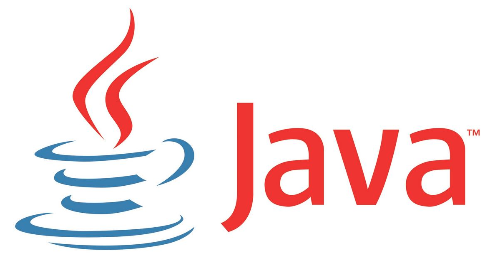
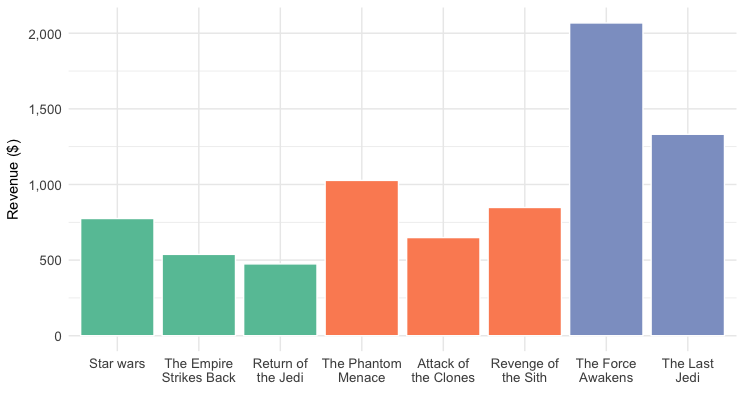

import { Head, Image, Root, Flex, Appear } from 'mdx-deck'
import { Invert, Split, FullScreen, SplitRight } from 'mdx-deck/layouts'
import { CodeSurfer } from "mdx-deck-code-surfer"
import Box from 'superbox'
import DemoStarwars from './DemoStarwars'
import SplitElement from './SplitElement'
import AppearDisappear from './AppearDisappear'
import base  from 'mdx-deck/themes'
import Highlight, { defaultProps } from "prism-react-renderer"
import nightOwl from "prism-react-renderer/themes/nightOwl"
import Code from './Code'


export const theme = {
  ...base,  
  //font: 'Roboto, sans-serif',
  font: 'system-ui, sans-serif',
  codeSurfer: {
    ...nightOwl,
    showNumbers: false
  }
}


<Head>
  <title>De l'R les devs Java!</title>

  <meta name="twitter:card" content="summary_large_image" />
  <meta name="twitter:site" content="@_bruno_b_" />
  <meta name="twitter:title" content="De l'R les devs Java!" />
  <meta name="twitter:description" content="Presentation faite à Devoxx Morocco 2018 sur le langage R à destination des Devs Java" />
  <meta name="twitter:image" content="https://raw.githubusercontent.com/bbonnin/talk-de-l-r-les-devs-java/master/devoxx-ma-2018/img/card.png" />
</Head>


# De l', les devs  !

Devoxx Morocco 2018


```notes
Bonjour à tous et bienvnue à ce quickie sur le monde merveilleux de R à destination des développeurs Java.
```

---

export default Split

<Box>
  <h2>whoami</h2>
  <p>Bruno Bonnin - @_bruno_b_</p>
  <i>Vieux développeur</i>
</Box>

<SplitElement img="img/haddock.png" backgroundColor="black" color="white"/>

```notes
Bien, tout d'abord, je me présente rapidement, blablabla...
```

---

<Image src="img/datafabric.png" size="contain"/>

```notes
Actuellement, je travaille comme architecte solution chez Saagie, qui développe un produit appelé Data Fabric,
qui permet d'accélérer la mise en oeuvre de vos projets autour de la data et de l'IA.
Depuis 1 an que je présente le produit, j'ai pu me former à R qui était le seul composant que je ne 
connaissais pas. Et cette présentation est un peu le résultat de ma montée en compétence et de mes étonnements 
de développeur Java dans un monde de statisticiens.
```

---

export default Split

<SplitElement img="img/Rlogo.png" backgroundColor="white" color="white"/>

<Box is="div" p={4}>
  <h2>Langage de script</h2>
  <p>Inventé en 1993 (Université d'Auckland)</p>
  <p>Dédié aux statistiques, très utilisé dans le monde de la data science</p>
  <p>Grande communauté, beaucoup de librairies</p>
  <p>Open source</p>
</Box>

[www.r-project.org](https://www.r-project.org/)

```notes
Qu'est-ce que R ?
R est langage essentiellement fait pour les statisticiens (Java non !!)
R fournit beaucoup de fonctions pour triturer la données dans tous les sens 
(d'un point de vue statistiques, bien sûr) (Java non !!)
Manipulation de données, calcul, préparation
```

---

<CodeSurfer
  title="Les interpréteurs"
  code={require("!raw-loader!./snippets/start.R")}
  steps={[
    { range: [1, 1], notes: "C'est parti !!!" },
    { range: [1, 6], notes: "R : pour Lancement de l'interpréteur en mode interactif" },
    { range: [8, 10], notes: "" },
    { range: [13, 14], notes: "Rscript : pour lancement de commandes ou de fichiers" }
  ]}
/>

```notes
Pour bien commencer avec R, vous allez installer un interpréteur, en général, celui fourni sur
le site officiel de R.
Et vous pourrez, alors, attaquer directement vos développements !!
```

---

## Commençons par les types...

Type | Exemples
---|---
__character__, __numeric__, __logical__ | "Hello World" 42 TRUE
__vector__ | c("Pomme", "Citron")<br/>2:5<br/>seq(2, 3, by=0.5)
__matrix__ | matrix(data, byrow = TRUE, nrow = 3)
__data.frame__ | data.frame(<br/>&nbsp;&nbsp;planete = c("Mercury", "Venus", "Earth"),<br/>&nbsp;&nbsp;diametre = c(0.382, 0.949, 1))


---

<CodeSurfer
  title="Continuons avec les vecteurs"
  code={require("!raw-loader!./snippets/vector.R")}
  lang="python"
  showNumbers={false}
  steps={[
    { range: [1, 1], notes: "Dans un vecteur, tous les éléments sont de même type" },
    { range: [3, 14], notes: "Accès aux éléments d'un vecteur" },
    { range: [16, 24], notes: "Quelques opérations" },
    { range: [26, 38], notes: "Nommage des éléments" },
    { range: [40, 44], notes: "Fonctions de base sur les éléments" }
  ]}
/>

```notes
Vecteurs: ensemble d'éléments de même types (conversion automatiques)
et le premier indice est 1 !!!
```

---

<CodeSurfer
  title="Les matrices"
  code={require("!raw-loader!./snippets/matrix.R")}
  lang="python"
  showNumbers={false}
  steps={[
    { notes: "Création et opérations sur les matrices" },
    { range: [1, 7], notes: "Sources des données" },
    { range: [9, 14], notes: "Création de la matrice à partir du vecteur" },
    { range: [16, 25], notes: "Nommage des colonnes/lignes" },
    { range: [27, 29], notes: "Accès aux éléments" },
    { range: [31, 33], notes: "Fonctions de base sur les éléments" }
  ]}
/>

```notes
Tableau à deux dimensions.
Pour construire une matrice, on part d'un set de données.
```

---

<CodeSurfer
  title="Les data frames"
  code={require("!raw-loader!./snippets/dataframe.R")}
  lang="python"
  showNumbers={false}
  steps={[
    { notes: "Création et opérations sur les data frames" },
    { range: [1, 1], notes: "Chargement des données" },
    { range: [3, 6], notes: "Premiers éléments de la data frame" },
    { range: [8, 11], notes: "Structure des données" },
    { range: [13, 21], notes: "Informations sur les données" },
    { range: [23, 28], notes: "Ajout d'une colonne" },
    { range: [30, 35], notes: "Opérations sur les éléments" }
  ]}
/>

```notes
Data frames (tableau à 2 dimensiopns)
Il peut y avoir des types différents, mais 
dans une colonne, tous les éléments doivent avoir le même type.
```

---

export default Split

<Code title="Graphiques" code={require("!raw-loader!./snippets/plots.R")}/>

<SplitElement img="img/plots.png" backgroundColor="white" color="black"/>

---

## Les packages

CRAN - Comprehensive R Archive Network

<a href="https://cran.r-project.org/web/packages/available_packages_by_name.html" target="_blank">https://cran.r-project.org/</a>


```notes
Sympa, riche
Bcp de mirroirs (dont certains avec leurs propres packages : se rapproche d'un modèle de type yum)
```

---

<CodeSurfer
  title="Packages"
  code={require("!raw-loader!./snippets/packages.R")}
  lang="python"
  showNumbers={false}
  steps={[
    {},
    { range: [1, 2], notes: "Installation depuis les repos du CRAN" },
    { range: [4, 7] },
    { range: [9, 10] },
    { range: [12, 13], notes: "Utilisation d'une librairie installée"},
    { range: [15, 24], notes: "Installation depuis des sources diverses" }
  ]}
/>

---

export default Split

<SplitElement img="img/ide_r.png" title="R" subtitle="R Studio, Jupyter, ..." backgroundColor="black" color="white"/>

<SplitElement img="img/ide_java.png" title="Java" subtitle="Intellij, Eclipse, ..." backgroundColor="white" color="black"/>

---

# R + Java ?

---

<CodeSurfer
  title="rJava"
  code={require("!raw-loader!./snippets/rjava.R")}
  lang="python"
  steps={[
    { notes: "Librairie d'interface avec Java (via JNI)" }
  ]}
/>

---

<CodeSurfer
  title="Renjin"
  code={require("!raw-loader!./snippets/renjin.java")}
  lang="java"
  steps={[
    { notes: "Interpréteur R pour la JVM (www.renjin.org)" },
    { range: [9, 13], notes: "Création du moteur R" },
    { range: [15, 17], notes: "Interprétation du code R" }
  ]}
/>

```notes
toutes les lib ne sont pas compatibles...
http://docs.renjin.org/en/latest/interactive/index.html
```

---

export default Split


<Box is="div" p={4} fontSize={1}>
  <h2>Polyglot Virtual Machine</h2>
  <ul style={{listStyleType: 'none'}}>
    <li>Langages pour la JVM (Java, Scala, Kotlin)</li>
    <li>Langages basées LLVM (C / C++)</li>
    <li>Javascript</li>
    <li>Python 3</li>
    <li>Ruby</li>
    <li><b>R</b></li>
  </ul>
</Box>


```notes
Peut faire tourner des programmes écrits dans tous ces langages.
Permet aussi de prendre le meilleur de chacun des langages et de les mixer !!
Parler du fait, qu'avec GraalVM, on va pouvoir construire des applications polyglot
et performante (image native), avec une bien meilleure intégration des différentes competences 
developpeurs/statisticiens/data scientists
```

---

## Demo - Box Office Star Wars



<!--DemoStarwars/-->

[https://github.com/bbonnin/talk-de-l-r-les-devs-java/tree/master/java-r](https://github.com/bbonnin/talk-de-l-r-les-devs-java/tree/master/java-r)


---

<CodeSurfer
  title="GraalVM (Java part)"
  code={require("!raw-loader!./snippets/plot_service.java")}
  lang="java"
  steps={[
  { notes: "Service construisant un SVG" },
    { range: [5, 6], notes: "Initialisation du contexte GraalVM" },
    { range: [8, 13], notes: "Chargement du code R" },
    { range: [15, 26], "notes": "Service web d'accès au SVG" },
    { range: [20, 21], notes: "Appel de la fonction R, qui retourne le SVG" }
  ]}
/>

```notes
Le moteur de R est FastR (d'Oracle)
```

---

<CodeSurfer
  title="GraalVM (R part)"
  code={require("!raw-loader!./snippets/plot_service.R")}
  lang="python"
  steps={[
    { notes: "Fonction R construisant un SVG" },
    { lines: [4, 9, 10], notes: "Utilisation d'un type (classe) venant de Java"},
    { lines: [6, 12], notes: "Utilisation direct de l'attribut filename (String)" },
    { lines: [6, 14, 15, 16, 17], notes: "Utilisation de l'attribut trilogies (tableau d'entiers)" }
  ]}
/>

```notes
Le moteur de R est FastR (d'Oracle ?)

```

---

<Image src="img/batman_superman.jpg" size="contain"/>

```notes
Donc, au tout début, j'avais un peu l'impression qu'il y avait 2 mondes qui se faisait face, chacun montrant
ses muscles à l'autre, mais au final, chacun a ses forces et ses faiblesses, mais je pense qu'avec GraalVM, on pourrait
avoir dans un proche avenir une coopération forte où chaque technologie pourra collaborer.
```

---

# Merci !

[https://github.com/bbonnin/talk-de-l-r-les-devs-java](https://github.com/bbonnin/talk-de-l-r-les-devs-java)
