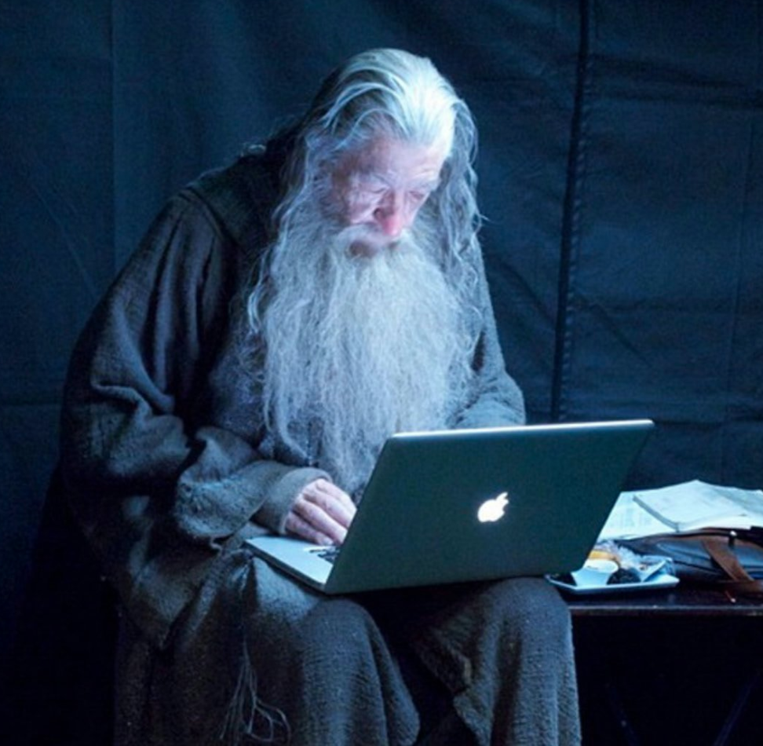

import { Head, Image, Root, Flex, Appear } from 'mdx-deck'
import { Invert, Split, FullScreen, SplitRight } from 'mdx-deck/layouts'
import { CodeSurfer } from "mdx-deck-code-surfer"
import Box from 'superbox'
import DemoStarwars from './DemoStarwars'
import SplitElement from './SplitElement'
import AppearDisappear from './AppearDisappear'
import base  from 'mdx-deck/themes'
import Highlight, { defaultProps } from "prism-react-renderer"
import nightOwl from "prism-react-renderer/themes/nightOwl"
import okaidia from 'react-syntax-highlighter/styles/hljs/ocean'
import prismPython from 'react-syntax-highlighter/languages/prism/python'
import Code from './Code'


export const theme = {
  ...base,  
  //font: 'Roboto, sans-serif',
  font: 'system-ui, sans-serif',
  codeSurfer: {
    ...nightOwl,
    showNumbers: false
  },
  prism: {
    style: okaidia,
    languages: {
      python: prismPython
    }
  }
}


<Head>
  <title>De l'R les devs Java!</title>

  <meta name="twitter:card" content="summary_large_image" />
  <meta name="twitter:site" content="@_bruno_b_" />
  <meta name="twitter:title" content="De l'R les devs Java!" />
  <meta name="twitter:description" content="Presentation faite à Devoxx Morocco 2018 sur le langage R à destination des Devs Java" />
  <meta name="twitter:image" content="https://raw.githubusercontent.com/bbonnin/talk-de-l-r-les-devs-java/master/devoxx-ma-2018/img/card.png" />
</Head>


# De l', les devs  !

Devoxx Morocco 2018


```notes
Bonjour à tous et bienvnue à ce quickie sur le monde merveilleux de R à destination des développeurs Java.
```

---

export default Split

<Box>
  <h2>whoami</h2>
  <p>Bruno Bonnin - @_bruno_b_</p>
  <i>Vieux développeur</i>
</Box>

<SplitElement backgroundColor="black" color="white">
  <AppearDisappear>
    
    
  </AppearDisappear>
</SplitElement>

```notes
Bien, tout d'abord, je me présente rapidement, je m'appelle Bruno Bonnin, je suis un vieux développeurs
ayant travaillé sur de nombreuses projets et j'ai pu mettre mon nez à tous les étages.
```

---

<Image src="img/datafabric.png" size="contain"/>

```notes
Actuellement, je travaille comme architecte solution chez Saagie, qui développe un produit appelé Data Fabric,
qui permet d'accélérer la mise en oeuvre de vos projets autour de la data et de l'IA.
Depuis 1 an que je présente le produit, j'ai pu me former à R qui était le seul composant que je ne 
connaissais pas. Et cette présentation est un peu le résultat de ma montée en compétence et de mes étonnements 
de développeur Java dans un monde de statisticiens.
```

---

## Slide de conclusion ?
<Image src="img/batman_superman.jpg" size="contain"/>

```notes
Donc, au tout début, j'avais un peu l'impression qu'il y avait 2 mondes qui se faisait face, chacun montrant
ses muscles à l'autre, mais au final, chacun a ses forces et ses faiblesses, mais je pense qu'avec GraalVM, on pourrait
avoir dans un proche avenir une coopération forte où chaque technologie pourra collaborer.
```

---

export default Split

<SplitElement img="img/Rlogo.png" backgroundColor="white" color="white"/>

<Box is="div" p={4}>
  <h2>Langage de script</h2>
  <p>Inventé en 1993 (Université d'Auckland)</p>
  <p>Dédié aux statistiques, très utilisé dans le monde de la data science</p>
  <p>Grande communauté, beaucoup de librairies</p>
  <p>Open source</p>
</Box>

[www.r-project.org](https://www.r-project.org/)

```notes
Qu'est-ce que R ?
R est langage essentiellement fait pour les statisticiens (Java non !!)
R fournit beaucoup de fonctions pour triturer la données dans tous les sens 
(d'un point de vue statistiques, bien sûr) (Java non !!)
Manipulation de données, calcul, préparation
```

---

<CodeSurfer
  title="Les interpréteurs"
  code={require("!raw-loader!./snippets/start.R")}
  steps={[
    { range: [1, 10], notes: "R : pour Lancement de l'interpréteur en mode interactif" },
    { range: [13, 14], notes: "Rscript : pour lancement de commandes ou de fichiers" }
  ]}
/>

```notes
Pour bien commencer avec R, vous allez installer un interpréteur, en général, celui fourni sur
le site officiel de R.
Et vous pourrez, alors, attaquer directement vos développements !!
```

---

<CodeSurfer
  title="La base"
  code={require("!raw-loader!./snippets/base.R")}
  lang="python"
  showNumbers={false}
  steps={[
    { notes: "Quelques notions de base..." },
    { range: [1, 4], notes: "Types de base et affectation" },
    { range: [6, 9], notes: "Les vecteurs (tous les éléments sont de même type)" },
    { range: [11, 22], notes: "Accès aux éléments d'un vecteur" },
    { range: [24, 32], notes: "Quelques opérations" },
    { range: [34, 48], notes: "Nommage des éléments" },
    { range: [50, 53], notes: "Fonctions de base sur les éléments" }
  ]}
/>

```notes
le premier indice est 1 !!!
```

---

<Image src="img/builtin_fcts.png" size="contain"/>


```notes
https://cran.r-project.org/doc/contrib/Short-refcard.pdf
https://www.rstudio.com/resources/cheatsheets/

Il existe de nombreuses fonctions mathématiques et statistiques fournies de base par R,
ainsi des fonctions d'accès aux fichiers, permettant même de lire certains formats (csv)
```

---

<CodeSurfer
  title="Les matrices"
  code={require("!raw-loader!./snippets/matrix.R")}
  lang="python"
  showNumbers={false}
  steps={[
    { notes: "Création et opérations sur les matrices" },
    { range: [1, 7], notes: "Sources des données" },
    { range: [9, 14], notes: "Création de la matrice à partir du vecteur" },
    { range: [16, 25], notes: "Nommage des colonnes/lignes" },
    { range: [27, 29], notes: "Accès aux éléments" },
    { range: [31, 33], notes: "Fonctions de base sur les éléments" }
  ]}
/>

```notes
Pour construire une matrice, on part d'un set de données.
```

---

<CodeSurfer
  title="Instructions"
  code={require("!raw-loader!./snippets/programming.R")}
  lang="python"
  steps={[
    { notes: "Tout ce qu'il faut développer de vrais programmes, bien sûr !" },
    { lines: [1, 13], notes: "Définition de fonction (passage par valeur des paramètres)" },
    { lines: [5, 10], notes: "Boucles for" },
    { range: [7, 9], notes: "Conditions" },
    { lines: [15], notes: "Appel de fonction" }
  ]}
/>

---

export default Split

<Code code={require("!raw-loader!./snippets/start.R")}/>

<SplitElement img="img/plots.png" title="Java" backgroundColor="white" color="black"/>

---

export default Split

<SplitElement img="img/ide_r.png" title="R" subtitle="R Studio, Jupyter, ..." backgroundColor="black" color="white"/>

<SplitElement img="img/ide_java.png" title="Java" subtitle="Intellij, Eclipse, ..." backgroundColor="white" color="black"/>

---

## Les packages

CRAN - Comprehensive R Archive Network

* https://cran.r-project.org/

```notes
- il existe bcp de sites mirroirs
```

---

<CodeSurfer
  title="Librairies"
  code={require("!raw-loader!./snippets/packages.R")}
  lang="python"
  steps={[
    { notes: "Installation depuis les repos du CRAN" },
    { range: [1, 2] },
    { range: [4, 5] },
    { range: [7, 10] },
    { lines: [12, 13] }
  ]}
/>

---

<CodeSurfer
  title="Librairies"
  code={require("!raw-loader!./snippets/devtools.R")}
  lang="python"
  steps={[
    { notes: "Installation depuis des sources diverses" },
    { lines: [1] },
    { range: [3, 4] },
    { lines: [6] },
    { range: [7, 9] },
    { range: [11, 12] }
  ]}
/>

---

# R et Java ?

---

<CodeSurfer
  title="rJava"
  code={require("!raw-loader!./snippets/rjava.R")}
  lang="python"
  steps={[
    { notes: "Librairie d'interface avec Java (via JNI)" },
    { range: [1, 3], notes: "Chargement et initialisation de la JVM" },
    { lines: [5], notes: "Instanciation d'un objet Java" },
    { range: [7, 8], notes: "Appel de méthode" },
    { range: [10, 14], notes: "Print d'un objet" }
  ]}
/>

---

<CodeSurfer
  title="Renjin"
  code={require("!raw-loader!./snippets/renjin.java")}
  lang="java"
  steps={[
    { notes: "Interpréteur R pour la JVM (www.renjin.org)" },
    { range: [9, 13], notes: "Création du moteur R" },
    { range: [15, 17], notes: "Interprétation du code R" }
  ]}
/>

```notes
toutes les lib ne sont pas compatibles...
http://docs.renjin.org/en/latest/interactive/index.html
```

---

export default Split


### Polyglot Virtual Machine

* JVM-based languages (Java, Scala, Kotlin)
* LLVM-based languages (C / C++)
* Javascript
* Ruby
* Python 3
* __R__

Intéraction possible entre les langages

```notes
Can run programs written in these languages
Permet aussi de prendre le meilleur de chacun des langages et de les mixer !!
```

---

export default SplitRight


## GraalVM: an example

* Java micro-service using [SparkJava](http://sparkjava.com/)
* Génération d'une diagramme en R avec Ggplot2


---

<CodeSurfer
  title="GraalVM (Java part)"
  code={require("!raw-loader!./snippets/plot_service.java")}
  lang="java"
  steps={[
  { notes: "Service construisant un SVG" },
    { range: [5, 6], notes: "Initialisation du contexte GraalVM" },
    { range: [8, 13], notes: "Chargement du code R" },
    { range: [15, 24], "notes": "Service web d'accès au SVG" },
    { range: [18, 19], notes: "Appel de la fonction R, qui retourne le SVG" }
  ]}
/>

```notes
Le moteur de R est FastR (d'Oracle)
```

---

<CodeSurfer
  title="GraalVM (R part)"
  code={require("!raw-loader!./snippets/plot_service.R")}
  lang="python"
  steps={[
    { notes: "Fonction R construisant un SVG" },
    { lines: [4], notes: "Utilisation d'un type (classe) venant de Java"},
    { lines: [9], notes: "Utilisation de la classe Logger venant de Java"},
    { lines: [6], notes: "Paramètre venant de Java (classe ParamsHolder)" },
    { lines: [9], notes: "Utilisation direct de l'attribut filename (String)" },
    { lines: [13, 14, 16], notes: "Utilisation de l'attribut trilogies (tableau d'entiers)" }
  ]}
/>

```notes
Le moteur de R est FastR (d'Oracle ?)

```

---


## Demo

<DemoStarwars/>

---

Vectors (one dimensional array): can hold numeric, character or logical values. The elements in a vector all have the same data type.
Matrices (two dimensional array): can hold numeric, character or logical values. The elements in a matrix all have the same data type.
Data frames (two-dimensional objects): can hold numeric, character or logical values. Within a column all elements have the same data type, but different columns can be of different data type.

---

## Conclusion

> “The best thing about R is that it was written by statisticians. The worst thing about R is that it was written by statisticians”

– Bow Cowgill
