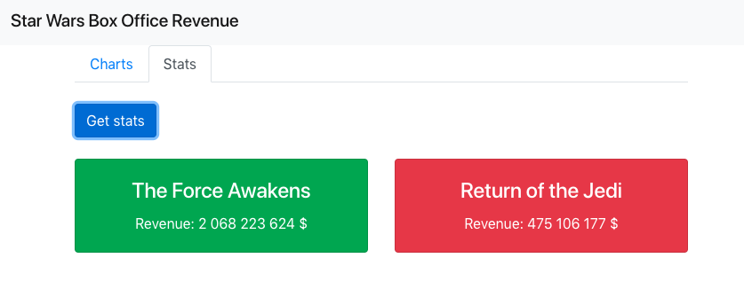
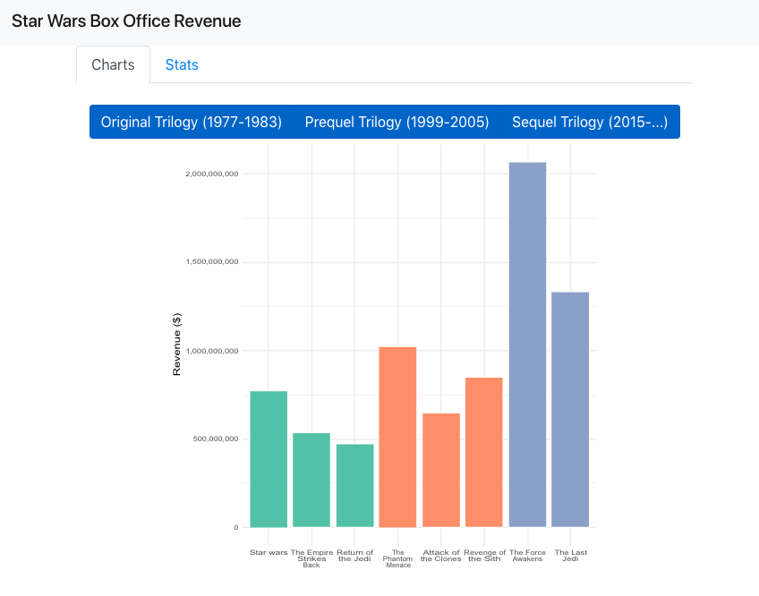

# Java + R = ❤

> Demo project for Java and R using GraalVM

> First version, inspired by: https://github.com/graalvm/graalvm-demos/tree/master/spring-r 

This demo has two parts:
* R script with several functions invoked by the Java part of the app
  * `plotRevenue`: it uses objects/classes from Java
  * `revenueStats`: for showing how to use a map as result of the function
* Java app using the R functions to process the data


## Pre-requisite

* Install `GraalVM`
* Set your `JAVA_HOME` to the JRE of your installation of GraalVM, for example:
```
export GRAALVM_HOME=/path/to/graalvm
export JAVA_HOME=$GRAALVM_HOME
export PATH=$GRAALVM_HOME/bin:$PATH
```

## Run

```
mvn exec:java -Pplot
```

Open your browser: `http://localhost:4567/`



