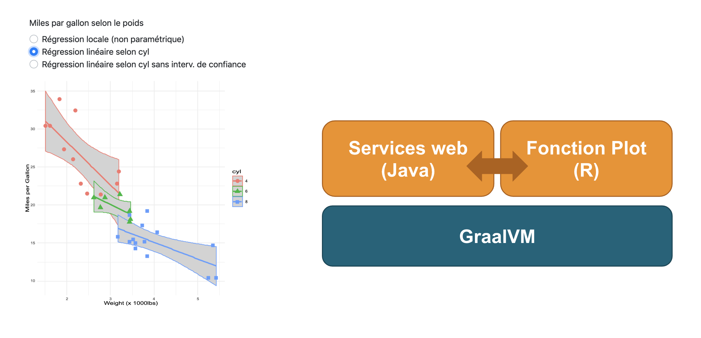

import { Head, Image, Root, Flex, Appear } from 'mdx-deck'
import { Invert, Split, FullScreen, SplitRight } from 'mdx-deck/layouts'
import { CodeSurfer } from "mdx-deck-code-surfer"
import Box from 'superbox'
import DemoStarwars from './DemoStarwars'
import SplitElement from './SplitElement'
import AppearDisappear from './AppearDisappear'
import base  from 'mdx-deck/themes'
import Highlight, { defaultProps } from "prism-react-renderer"
import nightOwl from "prism-react-renderer/themes/nightOwl"
import Code from './Code'


export const theme = {
  ...base,  
  //font: 'Roboto, sans-serif',
  font: 'system-ui, sans-serif',
  codeSurfer: {
    ...nightOwl,
    showNumbers: false
  }
}


<Head>
  <title>R + Java = 💛</title>

  <meta name="twitter:card" content="summary_large_image" />
  <meta name="twitter:site" content="@_bruno_b_" />
  <meta name="twitter:title" content="R + Java = 💛" />
  <meta name="twitter:description" content="Presentation faite au Nantes JUG en février 2019 sur le langage R à destination des Devs Java" />
  <meta name="twitter:image" content="https://raw.githubusercontent.com/bbonnin/talk-r-java-graalvm/master/nantes-jug-2019/img/card.png" />
</Head>

# R + Java = 💛

<small>(ou "<i>comment mettre de la data science dans sa webapp avec GraalVM</i>")</small>

Bruno Bonnin

*Nantes JUG - Février 2019*


```notes
Bonjour à tous et bienvnue à ce quickie sur le monde merveilleux de R à destination des développeurs Java.
```

---

export default Split

<SplitElement img="img/Rlogo.png" backgroundColor="white" color="white"/>

<Box is="div" p={4}>
  <h2>Langage de script</h2>
  <p>Inventé en 1993 (Université d'Auckland)</p>
  <p>À l’origine: S, un langage pour "programmer avec des données"</p>
  <p>Dédié à la manipulation de données, aux calculs et aux graphiques</p>
  <p>Très utilisé dans le monde de la data science</p>
  <p>Open source</p>
</Box>

[www.r-project.org](https://www.r-project.org/)

```notes
Qu'est-ce que R ?
R est langage essentiellement fait pour les statisticiens (Java non !!)
R fournit beaucoup de fonctions pour triturer la données dans tous les sens 
(d'un point de vue statistiques, bien sûr) (Java non !!)
Manipulation de données, calcul, préparation
```

---

<CodeSurfer
  title="Les interpréteurs"
  code={require("!raw-loader!./snippets/start.R")}
  steps={[
    { range: [1, 1], notes: "C'est parti !!!" },
    { range: [1, 6], notes: "R : pour Lancement de l'interpréteur en mode interactif" },
    { range: [8, 10], notes: "" },
    { range: [13, 14], notes: "Rscript : pour lancement de commandes ou de fichiers" }
  ]}
/>

```notes
Pour bien commencer avec R, vous allez installer un interpréteur, en général, celui fourni sur
le site officiel de R.
Et vous pourrez, alors, attaquer directement vos développements !!
```

---

# Maintenant, on peut coder 💻 !

---

<CodeSurfer
  title="La base"
  code={require("!raw-loader!./snippets/base.R")}
  steps={[
    { range: [1, 3], notes: "Les types de base (character, numeric, logical)" },
    { range: [5, 16], notes: "Boucles, conditions, ..." },
    { range: [18, 24], notes: "Les fonctions" }
  ]}
/>

---

<CodeSurfer
  title="R, pour les calculs..."
  code={require("!raw-loader!./snippets/calcul.R")}
  lang="python"
  showNumbers={false}
  steps={[
    { range: [1, 5], notes: "Dans un vecteur, tous les éléments sont de même type" },
    { range: [7, 10], notes: "Quelques opérations" },
    { range: [12, 15], notes: "Fonctions sur les vecteurs" },
    { range: [17, 22], notes: "Accès aux éléments d'un vecteur" },
    { range: [24, 26], notes: "Nommage des éléments" },
    { range: [28, 34], notes: "Dans une matrice, tous les éléments sont de même type" },
    { range: [36, 37], notes: "Accès aux éléments d'une matrice" },
    { range: [39, 42], notes: "Opérations sur les matrices" },
    { range: [44, 46], notes: "Fonctions de base sur les éléments" }
    
  ]}
/>

```notes
Vecteurs: ensemble d'éléments de même types (conversion automatiques)
et le premier indice est 1 !!!
```

---

<CodeSurfer
  title="R, pour la manipulation de données"
  code={require("!raw-loader!./snippets/dataframe.R")}
  lang="python"
  showNumbers={false}
  steps={[
    { range: [1, 1], notes: "Chargement des données" },
    { range: [3, 6], notes: "Premiers éléments de la data frame" },
    { range: [8, 10], notes: "Accès aux éléments" },
    { range: [12, 15], notes: "Structure des données" },
    { range: [17, 25], notes: "Informations sur les données" },
    { range: [27, 32], notes: "Ajout d'une colonne" },
    { range: [34, 36], notes: "Opérations sur les éléments" }
  ]}
/>

```notes
Data frames (tableau à 2 dimensiopns)
Il peut y avoir des types différents, mais 
dans une colonne, tous les éléments doivent avoir le même type.
```

---

export default Split

<Code title="R, pour les graphiques" code={require("!raw-loader!./snippets/plots.R")}/>

<SplitElement img="img/plots.png" backgroundColor="white" color="black"/>

```notes
ajout d'une droite de regression avec un intervalle de confiance
lm = linear model
```

---

<Image
  src='img/r-packages.png'
  size='contain'
/>

---

## Les packages

CRAN - Comprehensive R Archive Network

<a href="https://cran.r-project.org/web/packages/available_packages_by_name.html" target="_blank">https://cran.r-project.org/</a>


```notes
Sympa, riche
Bcp de mirroirs (dont certains avec leurs propres packages : se rapproche d'un modèle de type yum)
```

---

<CodeSurfer
  title="Packages"
  code={require("!raw-loader!./snippets/packages.R")}
  lang="python"
  showNumbers={false}
  steps={[
    {},
    { range: [1, 1], notes: "Installation depuis les repos du CRAN" },
    { range: [3, 3], notes: "Suppression d'un package" },
    { range: [5, 5], notes: "Utilisation d'une librairie installée"},
    { range: [7, 13], notes: "Installation depuis des sources diverses, hors CRAN" }
  ]}
/>

---

<CodeSurfer
  title="Manipulation de données avec dyplr"
  code={require("!raw-loader!./snippets/packages_ex.R")}
  lang="python"
  steps={[
    { range: [1, 7], notes: "Les packages peuvent n'être que des données !" },
    { range: [9, 29], notes: "Exploration avec dyplr" },
    { range: [31, 37], notes: "Inspiré par le package magrittr" },
    { range: [39, 42], notes: "Un dernier pour la route" }
  ]}
/>

---

# R + Java ?

---

<CodeSurfer
  title="rJava"
  code={require("!raw-loader!./snippets/rjava.R")}
  lang="python"
  steps={[
    { notes: "Librairie d'interface avec Java (via JNI)" }
  ]}
/>

---

<CodeSurfer
  title="Renjin"
  code={require("!raw-loader!./snippets/renjin.java")}
  lang="java"
  steps={[
    { notes: "Interpréteur R pour la JVM (www.renjin.org)" },
    { range: [9, 13], notes: "Création du moteur R" },
    { range: [15, 17], notes: "Interprétation du code R" }
  ]}
/>

```notes
toutes les lib ne sont pas compatibles...
http://docs.renjin.org/en/latest/interactive/index.html
```

---


---

export default Split


<Box is="div" p={4} fontSize={1}>
  <h2>Polyglot Virtual Machine</h2>
  <p>
  <span style={{fontSize: 'xx-large'}}>&laquo;</span><b>GraalVM</b> <small>is a universal virtual machine for running applications written in JavaScript, Python, Ruby,</small>
   <b> R</b><small>, JVM-based languages, and LLVM-based languages such as C and C++.</small><span style={{fontSize: 'xx-large'}}>&raquo;</span>
  </p>
  <p>
  <span style={{fontSize: 'xx-large'}}>&laquo;</span> <b>GraalVM</b> <small> removes the isolation between programming languages and enables interoperability in a shared runtime. 
    It can run either standalone or in the context of OpenJDK, Node.js, Oracle Database, or MySQL.</small><span style={{fontSize: 'xx-large'}}>&raquo;</span>
  </p>
</Box>


```notes
Peut faire tourner des programmes écrits dans tous ces langages.
Permet aussi de prendre le meilleur de chacun des langages et de les mixer !!
Parler du fait, qu'avec GraalVM, on va pouvoir construire des applications polyglot
et performante (image native), avec une bien meilleure intégration des différentes competences 
developpeurs/statisticiens/data scientists

Graal: JIT compilateur (just in time)
Truffle: Cadre d'implémentation linguistique / Interprète AST
Substrate VM: Java AOT (ahead of time), Bibliothèques et outils d'exécution pour la construction de code compilé
```

---


```notes
Le moteur de R est FastR (d'Oracle)
```

---

## Exemple - Génération de charts en R servis par un service Java 

<a href="http://localhost:4567/mtcars.html" target="_blank"></a>

---

<CodeSurfer
  title="GraalVM (Partie Java)"
  code={require("!raw-loader!./snippets/plot_service.java")}
  lang="java"
  steps={[
  { notes: "Service construisant un SVG" },
    { range: [5, 6], notes: "Initialisation du contexte GraalVM" },
    { range: [8, 13], notes: "Chargement du code R" },
    { range: [15, 27], notes: "Service web d'accès au SVG" },
    { range: [20, 21], notes: "Appel de la fonction R, qui retourne le SVG" }
  ]}
/>

---

<CodeSurfer
  title="GraalVM (Partie R)"
  code={require("!raw-loader!./snippets/plot_service.R")}
  lang="python"
  steps={[
    { notes: "Fonction R construisant un SVG" },
    { lines: [4, 9], notes: "Import et utilisation d'une classe Java"},
    { lines: [9, 11], notes: "Utilisation direct de l'attribut type (String)" },
    { range: [11, 29], notes: "Construction du SVG avec ggplot2" }
  ]}
/>

---

<Image src="img/batman_superman.jpg" size="contain"/>

```notes
Donc, au tout début, j'avais un peu l'impression qu'il y avait 2 mondes qui se faisait face, chacun montrant
ses muscles à l'autre, mais au final, chacun a ses forces et ses faiblesses, mais je pense qu'avec GraalVM, on pourrait
avoir dans un proche avenir une coopération forte où chaque technologie pourra collaborer.
```
---

# Pour aller plus loin

* https://www.r-project.org/
* https://www.meetup.com/fr-FR/Meetup-R-Nantes
* http://larmarange.github.io/analyse-R/manipuler-les-donnees-avec-dplyr.html
* https://www.graalvm.org/
* https://github.com/bbonnin/graalvm-examples

---

# Merci !

[github.com/bbonnin/talk-r-java-graalvm](https://github.com/bbonnin/talk-r-java-graalvm)

[bbonnin.github.io/talks/nantes-jug-2019](http://bbonnin.github.io/talks/nantes-jug-2019)